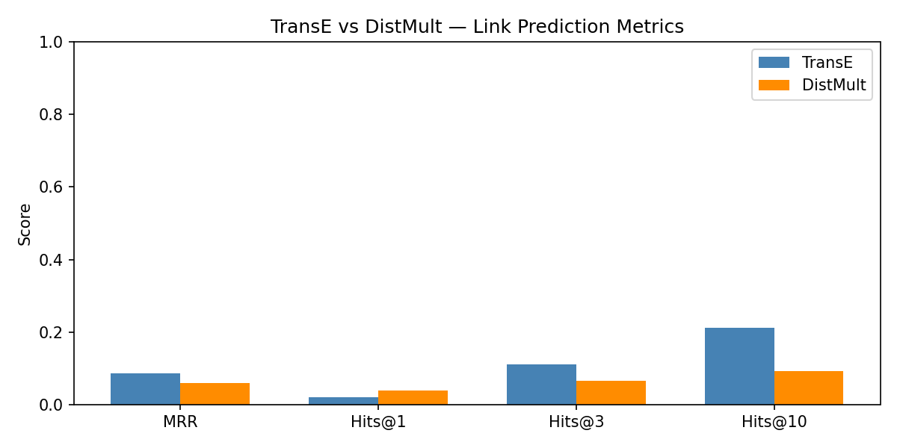

# Web Datamining & Knowledge Graph Project
**Minji Park · Mantra Outtandy — ESILV A4 S8**

Knowledge Graph Construction · Alignment · Reasoning & KGE · RAG over RDF/SPARQL

---

## Installation

### 1. Clone the repository
```bash
git clone https://github.com/immj1006/Web-Datamining-Minji-Park-Mantra-Outtandy.git
cd Web-Datamining-Minji-Park-Mantra-Outtandy
```

### 2. Install Python dependencies
```bash
pip install rdflib requests trafilatura spacy pandas numpy matplotlib scikit-learn torch pykeen owlready2
```

### 3. Download the spaCy model
```bash
python -m spacy download en_core_web_trf
```

### 4. Install and set up Ollama (required for the RAG module)

**On macOS / Linux:**
```bash
curl -fsSL https://ollama.com/install.sh | sh
```

**On Windows:**  
Download and install from: https://ollama.com/download

Then pull the Gemma 2B model:
```bash
ollama pull gemma:2b
```

Start the Ollama server (must be running before using the RAG section):
```bash
ollama serve
```
The server runs at `http://localhost:11434`.

---

## Hardware Requirements

- **RAM:** 8 GB minimum (16 GB recommended for KGE training)
- **GPU:** Optional but strongly recommended for KGE (PyKEEN with CUDA)
- **Disk:** ~2 GB for models and data
- **OS:** Windows / macOS / Linux

---

## How to Run

All code is in a single notebook: **`Project.ipynb`**

Open it with:
```bash
jupyter notebook Project.ipynb
```

The notebook is divided into 6 parts — run them **in order from top to bottom**:

| Part | Description | Output files generated |
|------|-------------|----------------------|
| **Lab 1** | Crawling + Cleaning + NER | `crawler_output.jsonl`, `extracted_knowledge.csv`, `candidate_triples.csv` |
| **Lab 2** | KB Construction + Alignment | `private_kb_initial.ttl`, `predicate_alignment.csv`, `ontology.ttl` |
| **Lab 3** | SPARQL Expansion | `expanded_kb.ttl`, `expanded_kb.nt`, `kb_statistics.csv` |
| **Lab 4** | SWRL Reasoning | `family.owl` (auto-downloaded) |
| **Lab 5** | KGE Training & Evaluation | `train.txt`, `valid.txt`, `test.txt`, `kge_evaluation_results.csv`, `size_sensitivity.csv` |
| **Lab 6** | RAG (NL→SPARQL + self-repair) | `rag_evaluation.csv` |

> ⚠️ **Before running Lab 6**, make sure Ollama is running (`ollama serve`) and the Gemma model is pulled (`ollama pull gemma:2b`).

---

## Demo Screenshot



---

## Project Structure

```
.
├── Project.ipynb               # Main notebook (all 6 labs)
├── crawler_output.jsonl        # Raw crawled data
├── extracted_knowledge.csv     # NER entities
├── candidate_triples.csv       # Extracted triples
├── private_kb_initial.ttl      # Initial RDF graph
├── ontology.ttl                # Ontology + predicate alignments
├── predicate_alignment.csv     # Predicate alignment table
├── expanded_kb.ttl             # Expanded KB (Turtle)
├── expanded_kb.nt              # Expanded KB (N-Triples)
├── kb_statistics.csv           # KB stats
├── train.txt                   # KGE train split
├── valid.txt                   # KGE validation split
├── test.txt                    # KGE test split
├── kge_evaluation_results.csv  # KGE metrics (MRR, Hits@1/3/10)
├── size_sensitivity.csv        # Size sensitivity analysis
├── rag_evaluation.csv          # RAG vs baseline evaluation
├── model_comparison.png        # Model comparison chart
├── README.md
├── .gitignore
└── requirements.txt
```
